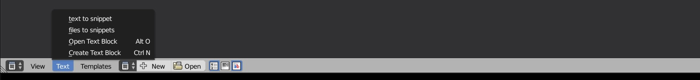

# snippet generator README

Turn your code to snippets little bit easier.

## Features

> Adds 2 functions to texteditor text menu:
Turns open texteditor text in to json snippet template.
Turns files in to snippet json snippet templates.

## Known Issues

None at the moment

## Release Notes

### 0.9.0
first release with ability to:
Turns open texteditor text in to json snippet template.
Turns files in to snippet json snippet templates.

-----------------------------------------------------------------------------------------------------------